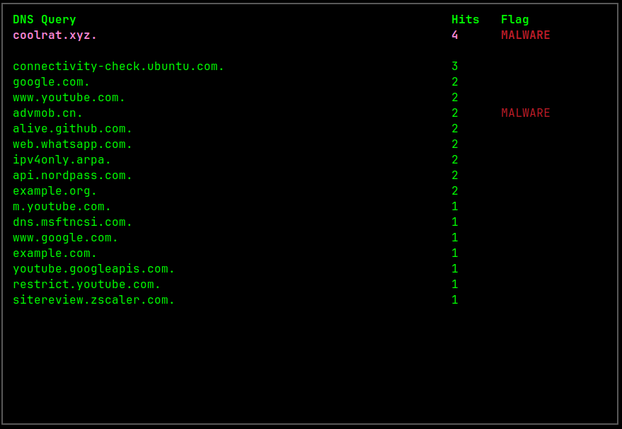

# GoDNSWatch

## Introduction
GoDNSWatch is a DNS monitoring tool that initiates a DNS server to listen on the localhost interface. It's designed to log and display a table of all DNS requests made, facilitating the analysis of DNS traffic. This tool is especially useful in identifying and flagging requests to known malicious domains, thereby aiding in DNS-based malware forensics.

## Features
- **DNS Monitoring:** Starts a DNS server to listen on the localhost for incoming DNS requests.
- **Request Logging:** Logs and displays a table containing all DNS requests made, for easy analysis and monitoring.
- **Malware Detection:** Allows the specification of a DNS blacklist containing known malware domain names. Any DNS request made to these domains is flagged as MALWARE, assisting in the identification and forensic analysis of malware communications.

## Usage
1. **Starting the Server:**
   To start the GoDNSWatch server, simply run the `godnswatch` command. This will initiate the DNS server on the localhost interface.

2. **Configuring DNS Blacklist:**
   To enable malware domain detection, specify a DNS blacklist file containing known malware domains. This can be done via a command-line argument or a configuration file.

3. **Analyzing DNS Traffic:**
   Once GoDNSWatch is running, it will automatically log all DNS requests made to the server. Requests to known malware domains will be flagged, allowing for immediate identification and further investigation.

## Contribution
Contributions to GoDNSWatch are welcome! Whether you're looking to fix bugs, add new features, or improve documentation, your help is appreciated. Please follow the standard GitHub pull request process to submit your contributions.

